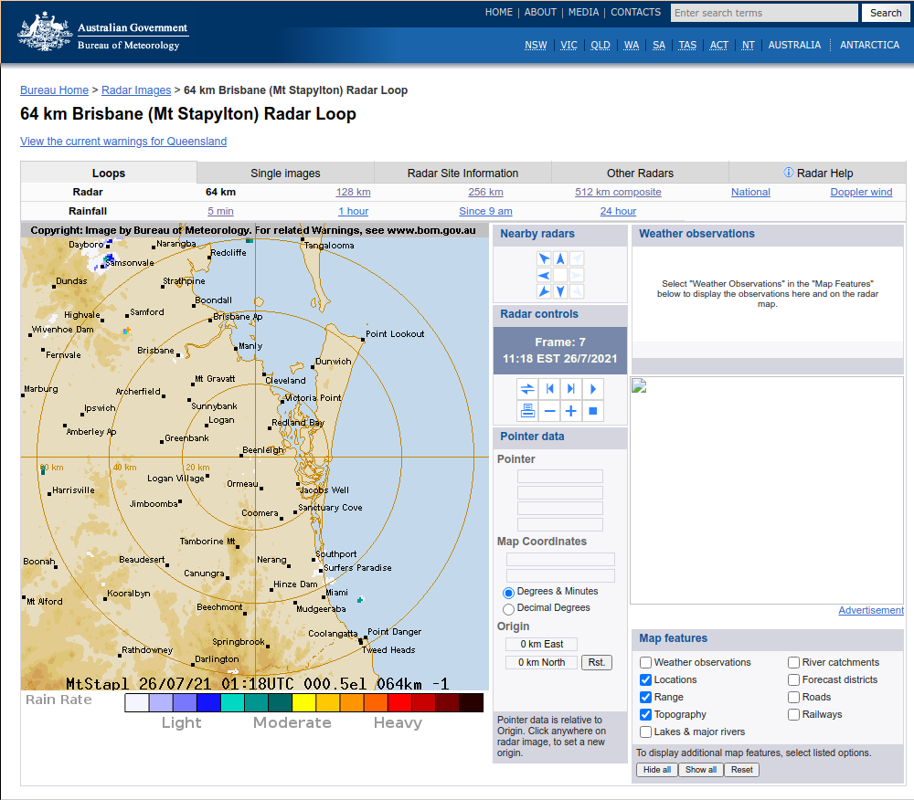
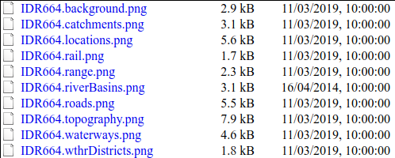

# Intro
I live in a city called Brisbane in a country called Australia.
Although we are famous for our sunny ☀️ weather, we get scary storms every now and then. 
When I find myself in a storm (or in any rain in general) I open a web browser and Google "Brisbane weather radar" to check where the clouds are. 
After repeating this for one too many times, I thought to myself: why bother Googling when I can make the image locally? 

And so I decided to make the radar animation a bit more accessible for myself.  

Fast forward a few hours, I made a script that generates a GIF animation of the radar for my local area. 
I hooked it up with cron to update the GIF regularly, and i3blocks to make it accessible from my desktop.
Now, the weather radar is a click away 😎


In this post, I will show you how to create this GIF image using the Australian Bureau of Meterology (BOM) website.

---

# Making the GIF image 
## The source
Australians can check their local weather radar at [bom.gov.au](http://www.bom.gov.au/):



This is where I source my images. 

Notice I said image"s"... Even though the BOM provide an animation on their website, it isn't a GIF image - it is actually a series of jpg images.

You can actually see this when you inspect the element on the website. Notice how the image source changes:


So, when we make our GIF, we have to do the same and string several images together. 
*Where do we get these images? Can we scrape it from the website?*

Well, not really...

```none
>> curl http://www.bom.gov.au/products/IDR664.loop.shtml
<p>Your access is blocked due to the detection of a potential automated access request. The Bureau of Meteorology website does not support web scraping and if you are trying to access Bureau data through automated means, you may like to consider the following options:</p>
<ul>
<li>An anonymous FTP channel: <a href="http://reg.bom.gov.au/catalogue/data-feeds.shtml">http://reg.bom.gov.au/catalogue/data-feeds.shtml</a> -  this is free to access, but use is subject to the default terms of the Bureau's copyright notice: <a href="http://www.bom.gov.au/other/copyright.shtml">http://www.bom.gov.au/other/copyright.shtml</a> </li>
<li>A Registered User service for continued use of Bureau data if your activity does not respect the default terms: <a href="http://reg.bom.gov.au/other/charges.shtml">http://reg.bom.gov.au/other/charges.shtml</a> noting charges apply to some data products. Please contact webreg@bom.gov.au  to discuss your requirements.</li>
</ul>
<p>If you still need assistance in accessing our website, please contact us by filling in your details at <a href="http://reg.bom.gov.au/screenscraper/screenscraper_enquiry_form/">http://reg.bom.gov.au/screenscraper/screenscraper_enquiry_form/</a> and we will get in touch with you. Thank you.</p>
```

So the website does not support automated access, but it provides a FTP server for its content. We will use this to source our images to create the GIF animation.

## Which image do I want?
You can check the ID of your local weather radar info in the URL. For example:
1. Google "[MY LOCATION] weather radar" and go to the BOM website
2. Select the radar distance - I picked "64km"
3. Copy the URL - mine was "http://www.bom.gov.au/products/IDR664.loop.shtml". "IDR664" is the ID for my selected radar.
4. Search the ID in the [BOM product list](http://www.bom.gov.au/catalogue/anon-ftp.shtml) to check that the ID is the correct one.

Now, if you access ftp://ftp.bom.gov.au/anon/gen/radar/, you will find the radar images that you want:


*...wait, do I see a GIF file there? Isn't that what I want? Why am I even trying to string images together?*

Don't be fooled! That is a GIF image that is still. It won't move. Trust me, I thought the same thing! 

## Coding
Now that we know where the images are, lets actually try to string the images together.

```python
#!/usr/bin/env python3

import io
import ftplib
from PIL import Image

product_id = 'IDR664' # The ID for our radar image
frames = [] # List to store the images

# Access the FTP server
ftp = ftplib.FTP('ftp.bom.gov.au')
ftp.login()
ftp.cwd('anon/gen/radar/')

# List comprehension to filter out the images we need
# Make sure the filename starts with the radar ID, and it ends with .png
# Take the last 5 images, since it is the most recent ones
files = [file for file in ftp.nlst() \
         if file.startswith(product_id) \
         and file.endswith('.png')][-5:]

# Loop over the files and append the image data into our image list
for file in files:
    file_obj = io.BytesIO()
    try:
        ftp.retrbinary('RETR ' + file, file_obj.write)
        image = Image.open(file_obj).convert('RGBA')
        frames.append(image)
    except ftplib.all_errors:
        pass

ftp.quit()

# Store the result as a GIF file
frames[0].save('/home/rolzy/scripts/weather_radar/radar.gif', format='GIF',
    save_all=True,
    append_images=frames[1:]+[frames[-1],frames[-1]],
    duration=400,
    loop=0)
```

We start off by defining some variables. 
- `product_id` is the ID value for the radar data that we found earlier.
- `frames` is the list where we will be storing the radar images into.

Then we initialize a connection with the BOM FTP server using [ftplib](https://docs.python.org/3/library/ftplib.html).

The next line of code looks at all the files in the FTP radar page, filter out the images that we want, and returns the 5 most recent once out of that. 
I packed all of this into oneline using list comprehension.

In the for loop, I read the image file (as bytes), open it as a Pillow Image object and append that to our `frames` list.

Lastly, we output the GIF file using the save() method available in Pillow Image objects. We can tell which images to append in the `append_images` argument. 
Here, I added the last frame thrice so that the most recent image is shown longer.

*Phew! The image is finally made. Lets have a look... Gah!*


The background is pitch black... but why?

## The background
The background for the radar image is available **separately** from the radar images.
It is actually available at: ftp://ftp.bom.gov.au/anon/gen/radar_transparencies/


There are a few layers that you can pick, some of them are not even used in the BOM website!
I decided to use `background`, `catchments`, `topography` and `locations` for my image.

Lets access these images and make it the background for our radar images.

```python
# The layers that we want
layers = ['background', 'catchments', 'topography', 'locations']

ftp = ftplib.FTP('ftp.bom.gov.au')
ftp.login()
ftp.cwd('anon/gen/radar_transparencies/')

for layer in layers:

    # Download the image
    filename = f"{product_id}.{layer}.png"
    file_obj = io.BytesIO()
    ftp.retrbinary('RETR ' + filename, file_obj.write)

    # Paste the image onto the background
    if layer == 'background':
        base_image = Image.open(file_obj).convert('RGBA')
    else:
        image = Image.open(file_obj).convert('RGBA')
        base_image.paste(image, (0,0), image)
```

Don't forget to paste the radar images onto the background too:
```python
# Loop over the files and append the image data into our image list
for file in files:
    file_obj = io.BytesIO()
    try:
        ftp.retrbinary('RETR ' + file, file_obj.write)
        image = Image.open(file_obj).convert('RGBA')
        frame = base_image.copy()
        frame.paste(image, (0,0),image)
        frames.append(frame)
    except ftplib.all_errors:
        pass
```
Check the GIF image, and it should be looking perfect!

You can access the full script at the bottom of the page.

# From here...
Once the script is functional, you can do all sorts of things with it!
For example, I use a job scheduler to run the script automatically.

In my Linux machine, I use cron to run the script every 6 minutes.
This is because the BOM uploads a new radar image at the same interval.

I have my radar GIF file saved to a specific location, which i3blocks can refer to open when my radar block is clicked.

# Conclusion
Thats a wrap! Hopefully someone out there can make use of this little code snippet :)

Even if you don't live in Australia, your local Weather Agency may provide similar services. (or even provide GIF images straight up!)

Have fun coding!

# References
I got inspired from this repository: https://github.com/bremor/bom_radar

# Full Script
```python
#!/usr/bin/env python3

import io
import ftplib
from PIL import Image

product_id = 'IDR664' # The ID for our radar image
frames = [] # List to store the images

# The layers that we want
layers = ['background', 'catchments', 'topography', 'locations']

ftp = ftplib.FTP('ftp.bom.gov.au')
ftp.login()
ftp.cwd('anon/gen/radar_transparencies/')

for layer in layers:

    filename = f"{product_id}.{layer}.png"
    file_obj = io.BytesIO()

    ftp.retrbinary('RETR ' + filename, file_obj.write)
    if layer == 'background':
        base_image = Image.open(file_obj).convert('RGBA')
    else:
        image = Image.open(file_obj).convert('RGBA')
        base_image.paste(image, (0,0), image)

# Access the FTP server
ftp = ftplib.FTP('ftp.bom.gov.au')
ftp.login()
ftp.cwd('anon/gen/radar/')

# List comprehension to filter out the images we need
# Make sure the filename starts with the radar ID, and it ends with .png
# Take the last 5 images, since it is the most recent ones
files = [file for file in ftp.nlst() \
         if file.startswith(product_id) \
         and file.endswith('.png')][-5:]

# Loop over the files and append the image data into our image list
for file in files:

    file_obj = io.BytesIO()

    try:
        ftp.retrbinary('RETR ' + file, file_obj.write)
        image = Image.open(file_obj).convert('RGBA')
        frame = base_image.copy()
        frame.paste(image, (0,0),image)
        frames.append(frame)
    except ftplib.all_errors:
        pass

ftp.quit()

# Store the result as a GIF file
frames[0].save('/home/rolzy/scripts/weather_radar/radar.gif', format='GIF',
    save_all=True,
    append_images=frames[1:]+[frames[-1],frames[-1]],
    duration=400,
```
