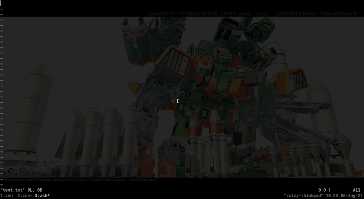
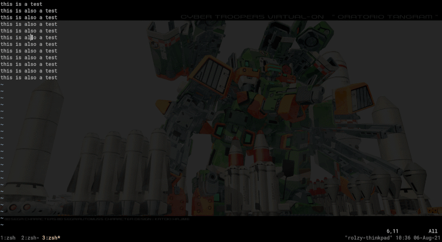
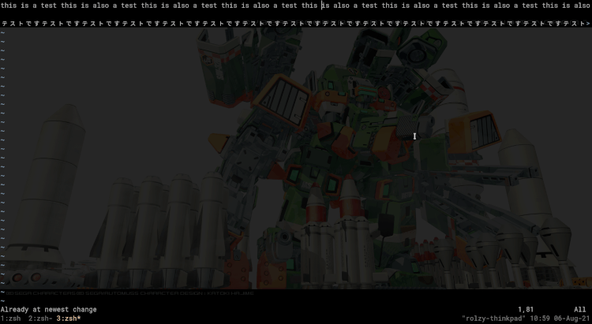
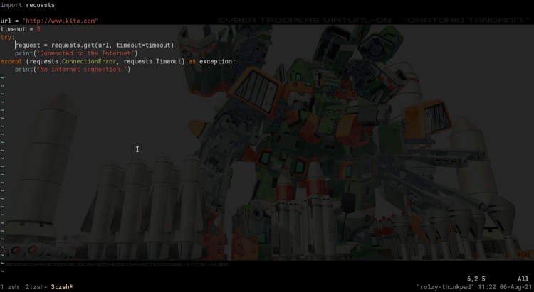
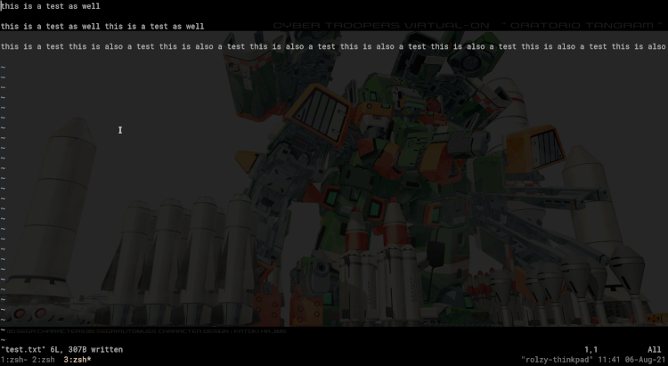
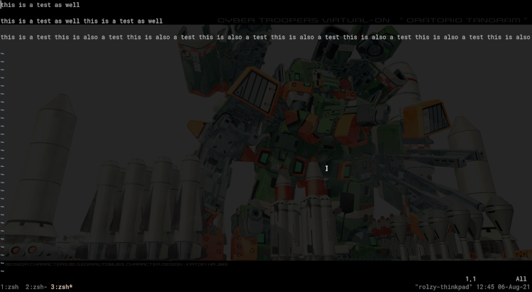

# はじめに
Vimって知ってます？
ターミナルから使う、テキストエディタです。

初見様お断りみたいな感じで、かなりハードルが高いVimですが、使いこなすとすんんんごいスピードで文章を編集できるようになります。
むしろ、Vimじゃないとダメって感じになります。

このシリーズでは、そんな初心者に厳しいVimをみなさんも使いこなせるようになるために、わかりやすく解説していこうと思います。

# モードについて
Vimには複数のモードがあります。このモードによって機能やショートカットが大幅に変わってくるので、まずはここを抑えるのが大事です。

| モード | 主な機能 |
| :---: | :---: |
| Normal | 文章の移動・コピー・ペースト・削除・その他もろもろ |
| Insert | 文章の入力 |
| Visual | 文章の選択 |

ここで大事なのがNormalとInsertモードの関係です。普通のIDEやエディタを使ってると、文章が入力できる状態がデフォだと思いますが、Vimのノーマルモードでは文章の入力ができません。
「じゃあなにができんだよ」って話なんですが、入力以外ならホント色々できます。可能性は無限大です。

最初のうちは、編集のほとんどの時間をInsertモードで過ごす時間が多いでしょう。普通のエディタのように、文章を入力してBackspaceで削除、みたいなことはVimでもできます。

しかし、Vimがうまくなればなるほど、Normalモードを使う時間が多くなってきます。Normalモードでの移動と編集に慣れれば、普通のエディタでは真似できないスピードを得ることができます。

このシリーズを通して、Normalモードを使う時間が少しでも多くなれば幸いです。

## モードの切り替え
ここからは実際にVimを使って、色々試しながら読んでください。

まずVimでファイルを開いてみてください。デフォルトでは、VimはNormalモードで始動します。

文章を入力するには、Insertモードに切り替えます。**i**を押してみてください。すると、左下に `-- INSERT --`と表示されたかと思います。
モードが切り替わったら、自由に文章を入力できます:

Normalモードに戻るときは、**Esc** を押しましょう。

Visualモードでは、文字・文章の選択ができます。**v** を押すことでVisualモードに入ることができます。

続いて、Vimでの移動について見ていきましょう。

# Vimでの横移動

## 矢印は使わない！
これまでIDEで移動したい場合、矢印キーを使うことが当たり前でした。
Vimでも矢印キーを使えますが、それより使ってほしいのが **h, j, k, l** です。

Normalモードで、**h, j, k, l** を使って文章を移動してみてください。

**h**で左、**l**で右、**j**で下、**k**で上にそれぞれ一文字ずつ移動します。

「矢印でいいじゃん…」と思ったそこのあなた、今すぐキーボードを見てください！

矢印キーってキーボードの角にありますよね！？
「移動」という基本的な動作でいちいち手を角に動かしてたら、それだけでタイムロス、ストレスの元です。

タイピングの「ホームポジション」の近くに移動キーを集めることで、無駄をなくすことができるんです！
普通のIDEならhjklは入力で使うから矢印キーに追いやられるんですが、Normalモードを持つVimだからできる効率的な移動手段です。

## もっと早く
**h, j, k, l** をチマチマ連打するのも面倒くさくないですか？
Vimでは、文章の単語ごとに移動することも可能です。

**w** で一単語先、 **b** で一単語前に飛べます。(日本語にも対応)

## もっともっと早く 
行の中にある文字にピンポイントで移動することもできます。

**f**を押した後に移動したい文字を押すと、その文字に移動できます。
行の中に指定された文字が複数ある場合、 「<b>;</b>」 で次のヒットに移動できます。また 「<b>,</b>」 を押して前に戻ることもできます。

カーソルの後ろに検索をかけたい場合は**F**を使います。

## 光速で動きたい
行の先頭と末尾への移動にもホットキーが用意されてます。

先頭: 「**^**」

末尾: 「**$**」

## 移動キーを数字と合わせる
最後に、連打できる移動キーは数字と合わせて使うことができます。

例えば、**5l** なら5文字先に動けるし、 **10b** なら10単語前に動くことができます。

# 最後に
今回はVimのモードと横移動について紹介しました。
少しでも参考になれば幸いです！

次回は縦の移動について詳しく書いていくので、お楽しみに！
